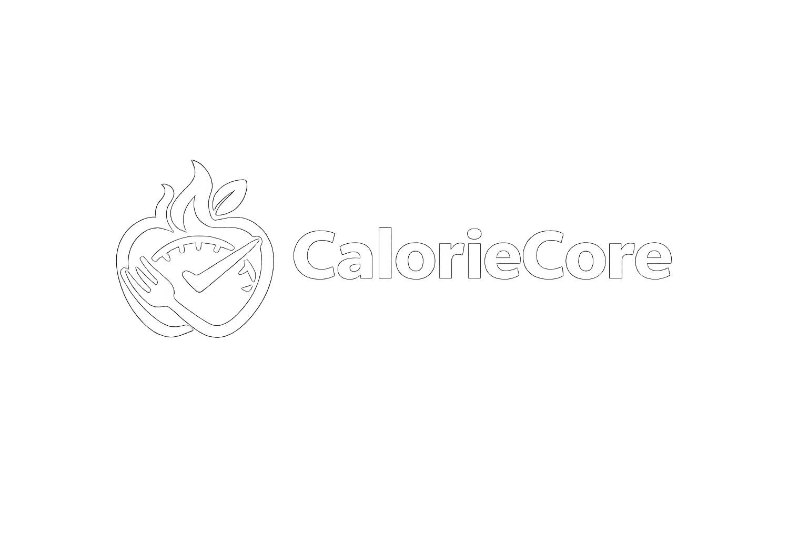

# **CalorieCore**





## **CalorieCore – Personal Calorie Tracker & Recipe Manager**
> A personal nutrition assistant and recipe manager built with ASP.NET Core, designed to help users track calories, manage meals, and stay organized with their fitness goals.


---

## 📋 Table of Contents

- [About the Project](#about-the-project)
- [Technologies Used](#technologies-used)
- [Prerequisites](#prerequisites)
- [Getting Started](#getting-started)
- [Project Structure](#project-structure)
- [Features](#features)
- [Usage](#usage)
- [Database Setup](#database-setup)
- [Configuration](#configuration)
- [Future Improvements](#future-improvements)
- [License](#license)
- [Contact](#contact)

---

## 📖 About the Project

CalorieCore is a web application designed to help you track your meals, monitor calories, and manage recipes easily. It's simple, interactive, and secure, giving users the ability to log physical activity and maintain a complete personal profile.

Whether you're trying to eat healthier or just stay organized with your nutrition, CalorieCore keeps all your data in one place. This project was built following **SoftUni ASP.NET Fundamentals** requirements, demonstrating MVC architecture, CRUD operations, and responsive design.

---

## 🛠️ **Technologies Used**

| Technology             | Version | Purpose                           |
|------------------------|---------|-----------------------------------|
| ASP.NET Core MVC       | 8.0     | Web framework                     |
| Entity Framework Core  | 8.0     | ORM / Database access             |
| SQL Server             | -       | Relational Database               |
| Bootstrap              | 5.3     | Responsive UI & Glassmorphism     |
| Razor Views            | -       | Templating engine                 |
| ASP.NET Identity       | -       | Authentication & Authorization    |

---

## ✅ Prerequisites

Make sure you have the following installed before running the project:

- [.NET SDK 8.0+](https://dotnet.microsoft.com/download)
- [Visual Studio 2022](https://visualstudio.microsoft.com/) (with ASP.NET & Web Development workload)
- [SQL Server](https://www.microsoft.com/en-us/sql-server) (LocalDB or Express)
- [Git](https://git-scm.com/)

---

## 🚀 Getting Started

Follow these steps to get the project running locally.

### 1. Clone the repository
```bash
git clone [https://github.com/borisetimov/CalorieCore.git](https://github.com/borisetimov/CalorieCore.git)
cd CalorieCore

```

### 2. Restore dependencies

NuGet packages should restore automatically when opened in Visual Studio, or run:

```bash
dotnet restore

```

### 3. Apply database migrations

Ensure your connection string is correct, then run:

```bash
dotnet ef database update

```

### 4. Run the application

Press **F5** or **Ctrl+F5** in Visual Studio, or use the CLI:

```bash
dotnet run

```

---

## 📁 **Project Structure**

```
```text
CalorieCore/
│
├── 📂 Data/
│   ├── 📄 CalorieCore.Data          # DbContext and Entity Framework Migrations
│   └── 📄 CalorieCore.DataModels    # Core entities (Meal, Recipe, UserAccount, UserActivity)
│
├── 📂 Services/
│   └── 📄 CalorieCore.Services      # Business logic (Auth filters, Calorie calculators, Email)
│
├── 📂 Web/
│   ├── 📄 CalorieCore.ViewModels    # Data transfer objects for Razor views
│   └── 📄 CalorieCore.Web           # Main MVC Project
│       ├── 📂 Controllers           # MVC Controllers (Account, Recipes, Meals, etc.)
│       ├── 📂 Views                 # Razor Pages organized by feature
│       │   ├── 📂 Account           # Login, Register, and Settings views
│       │   ├── 📂 Recipes           # Library, Details, and Partial views
│       │   └── 📂 Shared            # Global Layouts and Partials
│       └── 📂 wwwroot               # Static assets (CSS, Images, Logos)
│
├── 📄 CalorieCore.GCommon           # Shared validation constants and utilities
└── 📄 README.md                     # Project documentation

```

---

## ✨ **Features**

* [x] **Recipe Management:** Create, edit, and delete personal recipes; browse global recipes.
* [x] **Meal Logging:** Track intake with name, calories, and date using POST-Redirect-GET.
* [x] **Activity Tracking:** Log physical activities and monitor calories burned.
* [x] **User Identity:** Secure registration and login; private data access only for owners.
* [x] **Advanced UI:** Glassmorphism design with AJAX-powered modals for deletion.
* [x] **Validation:** Robust server-side and client-side data validation.

---

## 💻 **Usage**

1. **Register / Log In:** Start by creating an account to access the dashboard.
2. **Complete Profile:** Enter your age, weight, height, and goals to unlock full functionality.
3. **Recipes:** Browse the library. Use "Cook & Log" to instantly add a recipe to your daily meals.
4. **Logs:** View your personal activity and meal history in sorted tables.

---

## 🗄️ **Database Setup**

The project uses **Entity Framework Core** with the following table relationships:

* **UserAccount:** Parent table for Meals and Activities.
* **Recipe:** Contains `UserAccountId` (optional for Global recipes).
* **Meal / Activity:** Strictly linked to the `UserAccount`.

Connection string in `appsettings.json`:

```json
"ConnectionStrings": {
  "DefaultConnection": "Server=(localdb)\\MSSQLLocalDB;Database=CalorieTrackerDb;Trusted_Connection=True;"
}

```

---

## ⚙️ **Configuration**

Key security settings are enforced via:

* **Identity:** Restricting personal data to authenticated users.
* **Anti-Forgery:** Form protection against CSRF.
* **Encapsulation:** Global recipes are read-only for standard users.

---

## 🔮 **Future Improvements**

* [ ] Admin vs. Standard User roles.
* [ ] Analytics dashboard with trend charts.
* [ ] Recipe sharing and rating system.
* [ ] Mobile-first responsive enhancements.

---

## 📄 **License**

This project is licensed under the **MIT License**.

---

## 📬 **Contact**

**Boris Etimov** – [GitHub Profile]()

Project Link: [https://github.com/borisetimov/CalorieCore]()

---

*Built for the SoftUni ASP.NET Fundamentals course.*

```

```
